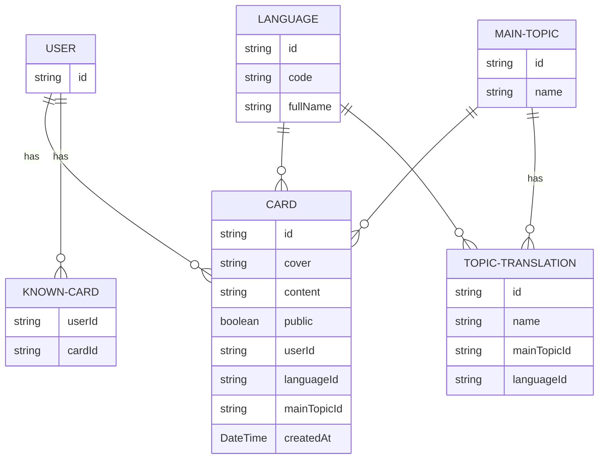

# CS - FlashCards - Intro
This application was inspired by [computer-science-flash-cards
](https://github.com/jwasham/computer-science-flash-cards) by jwasham, you can refer to his article [Retaining Computer Science Knowledge
](https://startupnextdoor.com/retaining-computer-science-knowledge/) for more information, for an Arabic version of it, I'll be creating one on my blog.

This app is built with [React-Native](https://reactnative.dev/docs/environment-setup), [Expo](https://docs.expo.dev/get-started/installation/) and [Firebase](https://firebase.google.com/) as a back-end service. 
## Running the app
You have two options (assuming you have expo, react native and the required tools) :
1. Expo's prebuild flow, to run the app (after you clone this repo) You can run one of the following commands:
```sh
# Build Android native prebuild
npx expo prebuild --platform android 

# Build iOS native prebuild
npx expo prebuild --platform ios
```
or
```sh
# Build and RUN Android native project
npx expo run:android

# Build and RUN iOS native project
npx expo run:ios
```

Consult expo's [Prebuild](https://docs.expo.dev/workflow/prebuild/) docs for more information.

2. Expo's EAS build, which builds the app on expo's managed hosts (it can actually build both IOS and Android apps):

for a specific platform you can run
```sh
# Build Android
eas build --platform android

# Build IOS
eas build --platform ios
```
or for all platforms
```sh
# Build for both Andoid & IOS
eas build --platform all
```
Consult expo's [EAS Build](https://docs.expo.dev/build/introduction/) docs for more information.

## Seeding the firestore database
[Firestore-backup-restore](https://github.com/dalenguyen/firestore-backup-restore) is used here to seed the database with languages which are REQUIRED, the rest of the data could be added from the app itself, you'll need a `serviceAccountKey.json` that contains the private key and gives you access to the database outside of your app, however you should NOT share this file under any circumstances, leaking this file might result in unauthorized access to your firestore database, hence your data.
```sh
# Install firestore-export-import as a dev dependency
npm install -D firestore-export-import
```

You can simply run (assuming you have a shell already pointing to the project's directory):
```sh
cd firestore
# Seed the database
node seed.ts
```

for more details refer to [Firestore-backup-restore](https://github.com/dalenguyen/firestore-backup-restore).

___
## Database tables 
Actually, here, they are called collections, since we are using firestore and it is a NoSQL kind of db; However this is the underlying structure:



User table/collection doesn't really exist nor used, we use firestore's auto-generated User UID; Known cards table/collection is not yet utilized (you can not assign a card as known, not to be shown again.).